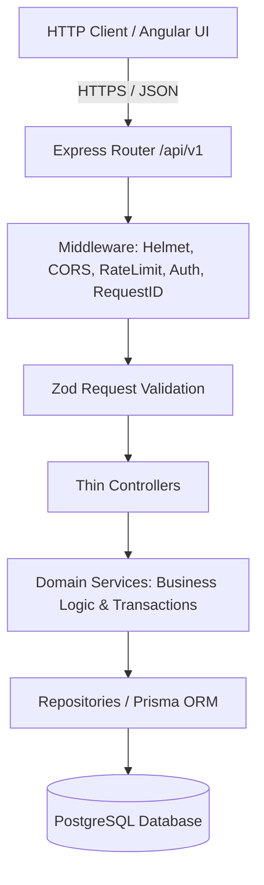

# RentSphere API

> Production-grade REST API for **RentSphere** — Heavy Machinery & Industrial Asset Leasing Marketplace.

---

## 1. Project Overview

RentSphere is a commercial equipment and heavy machinery leasing platform connecting asset owners (Leasers), construction contractors (Renters), and platform supervisors (Admins).

This repository contains the backend service built as a modular layered monolith using **Node.js**, **Express**, **TypeScript**, **PostgreSQL**, and **Prisma ORM**.

---

## 2. Architecture & Request Flow



---

## 3. Technology Stack

- **Runtime**: Node.js (>= v20)
- **Language**: TypeScript (ES2022, NodeNext modules)
- **Framework**: Express.js
- **Database**: PostgreSQL (Neon in production, local Docker/native in development)
- **ORM**: Prisma
- **Validation**: Zod
- **Security**: Helmet, CORS, argon2/bcrypt, JWT (Access + Refresh Rotation)
- **Logging**: Pino & pino-http with structured JSON output and request tracing
- **API Versioning**: `/api/v1`

---

## 4. Getting Started

### Prerequisites

- Node.js >= 20.0.0
- npm >= 10.0.0
- PostgreSQL instance (or Docker)

### Installation

```bash
# 1. Clone & enter directory
cd rent-sphere-api

# 2. Install dependencies
npm install

# 3. Configure environment
cp .env.example .env
```

### Running Locally

```bash
# Start development server with live watch (tsx)
npm run dev

# Build TypeScript to dist/
npm run build

# Run production build
npm start
```

---

## 5. Health Check Probes

- **Liveness Probe**: `GET /health`
- **Readiness Probe**: `GET /health/ready`
- **API Versioned Health**: `GET /api/v1/health`

---

## 6. Verification & Quality Commands

```bash
npm run typecheck    # TypeScript compiler check without emitting
npm run lint         # ESLint check
npm run format:check # Prettier formatting check
```
